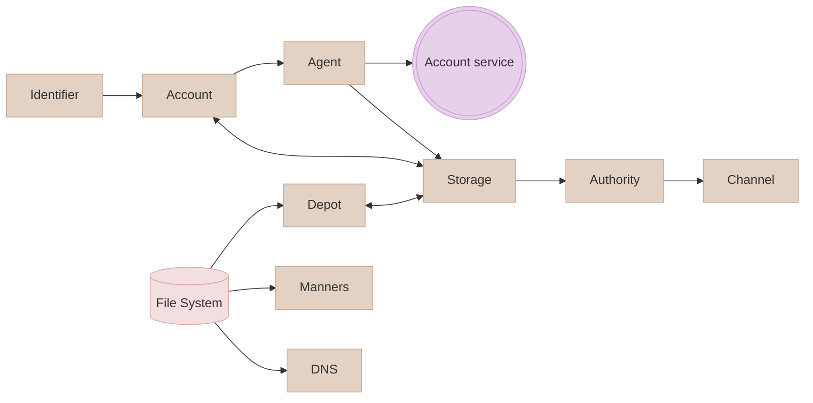

# ODD

## Introduction

The ODD SDK is a local-first toolkit that helps developers build systems that store data in a secure, reliable, and decentralised way. The focus is on the user, providing them with sufficient authority while still being convenient.

ODD stands for Open Distributed Data. We want our data accessible from anywhere and distributed, meaning that it can live partially or fully in multiple places. Ideally as much as possible of this data lives on the devices of the owner of the data and communication of this data would be done in a decentralised peer-to-peer fashion.

We also prefer not to rely on centralised services when providing users and devices with the needed authority. When a user starts using a new device, their existing device should be authorise the new one without any intervention from a central service. This can be done by giving the new device one or more tickets that can be verified on the spot.

Rather than putting everything in a closed system, ODD puts everything out in the open. That means encryption is used to keep data private. These encryption keys and authorisation tickets give us a chance to escape from passwords, so preferably passwords are avoided.

The ODD SDK relies on open protocols, this includes the [WNFS protocol](https://github.com/wnfs-wg) for the data management, and [UCAN](https://github.com/ucan-wg) to provide users and devices with the necessary authorisation.

## Implementation

ts-odd is written in Typescript, a Javascript dialect. The resulting code should be usable in any modern Javascript environment that supports the [Web Crypto API](https://developer.mozilla.org/en-US/docs/Web/API/Web_Crypto_API) and [Web Assembly](https://webassembly.org/). It uses the Rust implementations of [WNFS](https://github.com/wnfs-wg/rs-wnfs) and [UCAN](https://github.com/ucan-wg/rs-ucan) which compile to Web Assembly.

Various other pieces are layered on top of these core protocols and assumptions, these are called "components" in ts-odd. These allow us to adapt to various technologies and environments. We'll start with the components that are closest to the data and go from there. These are:

1. Depot
2. Account
3. Identifier & Agent
4. Authority
5. Channel
6. DNS
7. Storage
8. Manners

The following graph shows a rough overview how the components relate:

These are only some of the relationships, but it should you a rough idea of some important concepts in the SDK. Starting from the top we have the identifier component that provides an authorisation ticket to the account component, which in turn makes another ticket and passes it to some external account service. Note that this is just an example, it may not use an external service.

Then looking at the 'Storage' component, this would be the session storage. In the default implementation the (file system) data is stored here, but also the authorisation tickets and the cryptographic keys. Then the authority component can redistribute those authorisation tickets if granted by the user, which happens over a channel.

There's some other components such as DNS and "manners" which are somewhat less important, but more on those later.

All of these components are grouped together in a `Program` instance, which will be your main interaction point. It's an artificial environment with the components you've chosen to use. For example, you could have a program that stores session data in memory, or one that stores it in indexedDB.

### Depot

The 'WNFS' file system that holds the user's data consists out of [IPLD](https://ipld.io/) blocks. These blocks make up the content-adressable web, another core idea to the ODD stack. A content address gives us a fingerprint for our data, whenever the data changes, the fingerprint changes. This means that when you provide a specific content address, you will always get back the same data. This means that the storage associated with the file system is tamper-proof, setting us up with an ideal primitive for data syncing.

This component is reponsible for retrieving and storing these IPLD blocks. On the lowest level this means for any given bytes (data) give me back a CID (content address). And vice versa, when I present a CID, give me back the bytes for it.

Looking at this from a higher viewpoint, this unlocks the larger part of data syncing, we can transfer our blocks to a remote source.

Learn more about [content addressing](https://dweb-primer.ipfs.io/avenues-for-access/power-of-content-addressing).

### Account

Most of the time to push the data to a remote endpoint you will need some sort of account system, otherwise anyone could fill up the external storage space which costs money. The user accounts will be represented through authorisation, UCANs, our authorisation tickets.

This ODD SDK program has a UCAN store, a repository of "authorisation tickets" collected from various sources. The account system is one of those sources. It can also access that UCAN store and then use it to authorise various actions.

This may also tie into the other part of data syncing, taking the file system's root CID (aka. data root) and storing it somewhere the other devices can reach it.

### Identifier & Agent

The account system also involves the identifier and agent components. The identifier signifies one of the user's identifiers and the agent delegates to external services. Both of these use decentralised identifiers ([DID](https://www.w3.org/TR/did-core/)s). These DIDs could, for example be derived from a passkey, a blockchain wallet or a `CryptoKeyPair` from the Web Crypto API.

The reason we have two components here is so that the identifier doesn't need to sign every time. This is useful for example with passkeys or blockchain wallets where you would get a popup each time you'd need to sign something.

Typically the agent will use a temporary session key pair and the identifier is the more permanent identifier. Example flow: Identifier delegates to agent, agent contacts remote account service, account service issues UCANs addressed to identifier. Those UCANs are then used throughout the SDK to check for capabilities, etc.

### Authority

This component is reponsible for providing and requesting authority. Which technically means providing and requesting UCANs and file system secrets (access keys).

### Channel

Channels are used for authority exchange and to communicate file system changes to a user's other devices. This component is used to create a channel. It serves as the public channel for the [AWAKE protocol](https://github.com/ucan-wg/awake) which bootstraps a secure session. Using this protocol we can establish point-to-point communication which is fully secure and encrypted.

### DNS

Determines how to do DNS queries.

### Storage

A key-value storage abstraction responsible for storing various pieces of session data, such as UCANs and crypto keys (depending on other components used).

### Manners

The manners component allows you to tweak various behaviours of an ODD program, such as logging and file system hooks (eg. what to do after a new file system is created).
